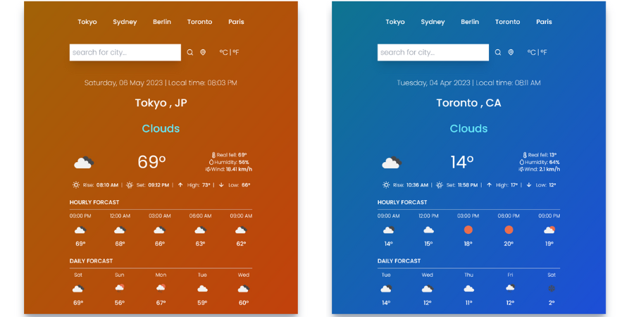

### Weather Forcast React App :)

Weather Forcast app using **React** and **OpenWeather** API.

See the [Live Project](https://maxjn-weather-forcast.pages.dev/).

###### Technologies

- HTML,Tailwindcss
- ES6
- React
- useState & useEffects Hooks
- Uicons
- **Luxon** package for time transfering
- **Toastify** package for toast messages
- **City-Timezone** package for getting the time zone name

###### Features

Showing Weather:

- based on location
- based on search results
- in °F/°C
- hourly forcast
- daily forcast

## Installing / Getting started

```shell
npm install

npm run start
```

###### Image


